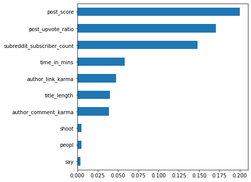

#  Project 3: Web Scraping & Classification

### Executive Summary 

In this project, I am investigating the performance of different classification methods on reddit posts scraped using PRAW. I preprocessed the data using natural language processing techniques such as stopword removal, lemmatization, stemming,TF-IDF weighting,test for feature selection.I tried various classification algorithms and found that an Ensemble Classifier performed the best on our dataset followed by a RandomForestClassifier.  The best accuracy is 79% with bagging classifier which is an ensemble classification method.

---

### Description

This project involves web-scraping, NLP, and classification models.

---

### Scenario

 Nate Silver and co. at FiveThirtyEight have agreed to hear my pitch for a story in two weeks!

This piece is going to be on how to create a Reddit post that will get the most engagement from Reddit users. Because this is FiveThirtyEight, we're going to have to get data and analyze it in order to make a compelling narrative.

---

### Problem Statement
For this project, the problem statement will be:

 _What characteristics of a post on Reddit are most predictive of the overall interaction on a thread (as measured by number of comments)?_

The method for acquiring the data will be scraping the 'hot' threads as listed on the [Reddit homepage](https://www.reddit.com/). I acquired following  pieces of information about each thread using PRAW, the Python Reddit API Wrapper (https://praw.readthedocs.io/en/stable/index.html):
1. The post id of the thread
2. The author's comment_karma for the post
3. The author's link_karma for the post
4. The time in minutes the post held as hot until we scraped it
5. Identifier whether the post is original or not
6. The title and of the post
7. The id of the post
8. The number of comments on the thread
9. Identifier whether the post is for audience ovr 18 
10. Score of the post
11. Whether the post has link
12. Whether the post has a spoiler
13. Whether the post is stickied
14. The subreddit id that the thread corresponds to
15. The subreddit that the thread corresponds to
16. The number of subscribers that the subreddit the post belongs to has
17. The upvote ratio on post
18. The url of the post

After getting the data, I will build a classification model that, using Natural Language Processing and any other relevant features, predicts whether or not a given Reddit post will have above or below the _median_ number of comments.

---

### Dataset

1. I'll be utilizing a dataset derived from live web data: [Reddit.com](https://www.reddit.com/)

2. To get the data, Iwill use the praw,csv and datetime library 

---

#### Steps Involved

- In this project, I scraped hot threads on Reddit using PRAW and saved them as a csv file 'reddit_hot_posts.csv'. 
- After that I did exploratory data analysis on this data and understood data on a deeper level.
- I dropped 'subreddit_name','subreddit_id','post_name' and 'post_url'which seemed irrelevant at this point of time
- I created a new variable '**target'** which is 1 when number of comments is more than the median number of comments and 0 when it is less than the median number number of comments for each post and '**title_length**' which is equal to word count of the post title for each post.  
- I dropped 'post_num_comments' from the data as it would lead to data leakage.
- After that I created dummies for subreddits found in the data.  
- I used two NLP algorithms namely, Countvectorizer() and Tfidfvectorizer() converted the posts' titles into a vector. However, before using the NLP algorithms, I used Stemmer and Lemmatizer functions on post titles as also, some other cleaning using re library to create a new variable 'post_title_processed'.
- Combining this vector with prior data I created new datasets one each for the NLP algorithm used. I dropped variables 'post_title' and 'post_title_processed' from the data after this. 
- After that I used RandomForestClassifier,Logistic Regression, KNeighbors Classifier and Ensemble Methods (Decision Tree Classifier,Bagging Classifiers and Decision Stump) to fit on my dataset and score them.

---

### Organization of the Project
The project is organized into following divisions:

a) Code-
   For data scraping:
   -reddit_scraper.py
   -reddit_subreddit_fix.py

   For EDA and modelling:
   -Saba_Project_3.ipynb

b) Data
   1. **reddit_hot_posts.csv**- raw data after scraping reddit using PRAW
   2.**Data_before_preprocessing.csv**-data after basic cleaning and dropping duplicates from reddit_hot_posts.csv
   3. **Subreddit_dummies_with_countvector.csv**- Data with dummies for subreddits and countvectorizer() used on post titles
   4. **Subreddit_dummies_with_Tfidf.csv**- Data with dummies for subreddits and Tfidf() used on post titles
   5. **reddit_hot_posts_sample.csv**-Sample before running script full on reddit
   
c) README.md
   
d) requirements.txt
   
e) .gitignore
   
---

### Models Employed

1. RandomForestClassifier-with and without GridSearch
2. KNNClassifier-with and without gridsearch, gridsearch one is too heavy so running it on a small subset just for demonstration purpose
3. LogisticRegression
4. BaggingClassifier
5. DecisionTreeClassifier
6. Decision Stump
   
Models are run on two set of datasets-one where I used Countvectorizer() on post titles and the other where I used  TfidfVectorizer() on post titles

---

### Results

The most frequently occurring sub-reddits are shown in the following graph:
 

   

 

The most common words found by countvectorization are as shown below
 

   

 
The most common words found by tfidfvectorization are as shown below
 

   

 
These words are not same among the two vectorization methods.

The most important features according to the `RandomForestClassifier` for Countvectorization are shown in the graph below:
 

   

 

The most important features according to the `RandomForestClassifier` for Tfidfvectorization are shown in the graph below:

 

   

 

---

### Conclusion and Recommendations

- Bagging is giving the best score on the dataset followed by Random Forest Classifier with gridsearch and Decision Tree.

- KNeighbors classifier with gridsearch is too burdensome for my system. The complexity of algorithms therefore should be considered into account while dealing with huge datasets.

- KNeighbors classifier(without gridsearch) is giving best result at k=5.

- The respective scores of different models on both Tfidf vectorised and Countvectorized data are almost similar. However, the most common words found by both methods are different.

- I had removed num_of_comments on post from X as including that would lead to leaking info in the target variable.

- After analysing, I realised that time_in_min the post stays on hot thread may be very likely be highly correlated with number of comments, so another analysis after removing this variable should be done to see the results and compare.

- Varying the max_features in the Countvectorizer and Tfidfvectorizer will give different results. Future analysis may involve tinkering with this.

- My recommendations based on the analysis for a new post-

1. Post in a subreddit with high subscriber count.
2. The author's karma(link and comment) matters!(Eternal truth)
3. Have a decent title length
4. Politics, games, funny,mademesmile,antiwork etc are popular topics. Tag them in your post.
5. Ask family, friends,co-workers and acquaintances to upvote your post. Try upvoting using bots??

---

